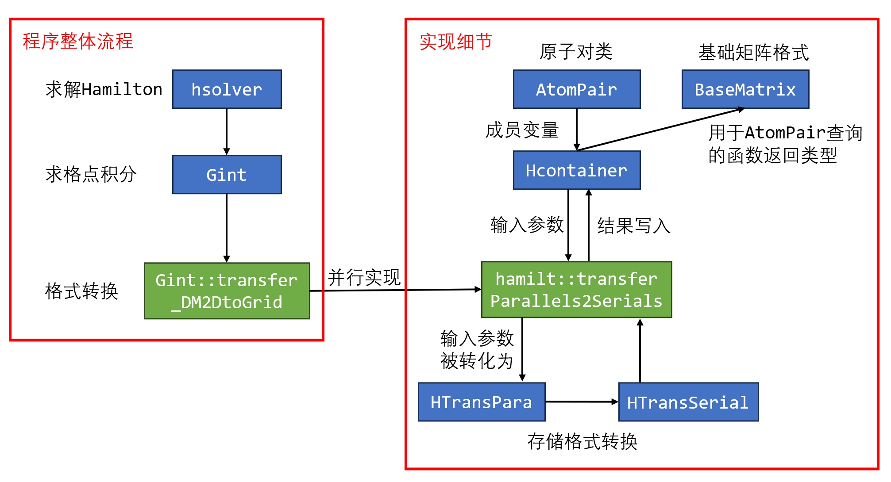
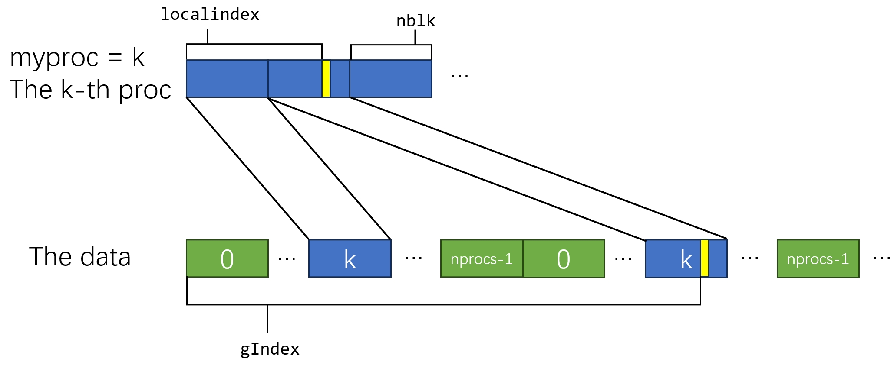
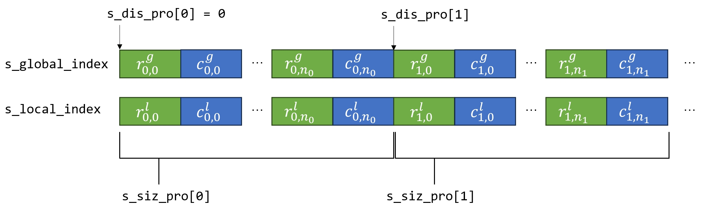

# 并行程序设计 - 大作业文档 6/15

## 目前提交的PR总结

- [x] 表示已接受
- [x] ([#4229](https://github.com/deepmodeling/abacus-develop/pull/4229)) 移除不再被使用的`Gint_Gamma::vl_grid_to_2D`函数相关的代码
- [x] ([#4239](https://github.com/deepmodeling/abacus-develop/pull/4239)) 对`BaseMatrix`类进行优化，使之更安全
- [x] ([#4243](https://github.com/deepmodeling/abacus-develop/pull/4243)) 对`AtomPair`类进行优化，修改了成员`R_index`的接口以及与之相关的代码
- [ ] ([#4399](https://github.com/deepmodeling/abacus-develop/pull/4399)) 在`HTransPara`的`pack_data`和`unpack_data`中添加了OpenMP进行并行


## 1. 项目背景

本项目的主要背景是利用原子轨道线性组合方法（LCAO）求解电子体系的哈密顿量，这是一个厄米矩阵

由于电子体系具有不同的物理相互作用，在代码中的哈密顿矩阵涉及两个不同的模块：双中心积分和格点积分，而这两种积分对于矩阵存储格式的要求是不同的。本项目的目标就是将两种存储格式进行梳理和抽象，尝试提炼出一个通用的哈密顿矩阵存储与调用的接口格式供不同模块使用。

## 2. 代码解读

在作业布置时的推荐阅读代码为`source/module_hamilt_lcao/module_gint/gint_gamma_vl.cpp`中的<b>`Gint_Gamma::vl_grid_to_2D`</b>函数，该函数用于将grid格式转换为2D格式。但后来，我们发现这个函数已经不再被使用，代替这个函数功能的代码在`abacus-develop/source/module_hamilt_lcao/module_hcontainer`，这个路径下的代码对Hamilton矩阵及其转换利用模板编程做了更为抽象、泛用的封装，因此本部分将描述对这部分代码的研究与解读。

针对`Gint_Gamma::vl_grid_to_2D`函数不再被使用的问题，我**提交了一次PR([#4229](https://github.com/deepmodeling/abacus-develop/pull/4229))并且已经被接受**，对代码进行了一定重构，删除了与该函数相关的部分代码，提高了项目的可维护性。但是在**附录B**部分仍然保留了对这部分代码的解读，原因在于我发现新的代码与旧的代码在进行转换时，使用的算法和方式是十分类似的，只是在封装和泛化上做得更好，因此，对原来代码的解读也将有助于我们进一步理解新的代码。

以下是对项目中比较重要的代码的解读和优化

### 2.1 类与函数调用流程



### 2.2 `BaseMatrix`类

用于存储原子对的局部哈密顿量，既可以本身存储这个矩阵，也可以只访问由其他类存储的矩阵，这一点由私有变量`allocated`来控制，其私有成员变量包括
```cpp
private:
    // 指向哈密顿矩阵的指针
    T* value_begin = nullptr;

    // 若为true，表明矩阵元素由对象自身存储，
    //    此时value_begin指向的内存空间应在析构时被释放
    // 若为false，表明矩阵元素由其他类对象存储，这个类仅起到访问作用
    bool allocated = false;

    // 矩阵的行数和列数
    int nrow_local = 0;
    int ncol_local = 0;
```

在阅读这个类的代码时发现以下可能的优化
- 在重载`operator=`的时候，给`this->value_begin`赋值前没有对可能的原有内存空间进行`delete`，可能导致内存空间浪费或泄露，因此添加了以下代码
  ```cpp
  if (this->allocated)
  {
      delete[] this->value_begin;
  }
  ```
- 在类函数`add_array`、`add_element`、`get_value`等处没有判断`value_begin`是否为空，均额外添加了debug语句
  ```cpp
  #ifdef __DEBUG
  assert(this->value_begin != nullptr);
  #endif
  ```
- 类函数`add_array`的注释可能引起误解，这个函数的实现是
  ```cpp
  for (int i = 0; i < nrow_local * ncol_local; ++i)
  {
      value_begin[i] += array[i];
  }
  ```
  但是注释内容为`save data from array into matrix`，并没有体现出这个加法的效果，因此将其中的`save`修改为`add`

**以上修改已经提交了PR([#4239](https://github.com/deepmodeling/abacus-develop/pull/4239))并已被接受**

### 2.3 `AtomPair`类

构建原子对，并可以利用这个原子对查询`BaseMatrix`类的对应的Hamilton矩阵，一些比较重要的成员如下
```cpp
// 原子对的原子序号
int atom_i = -1;
int atom_j = -1;

// R_index是一个长度为3的倍数的vector，每三个元素是一组<rz,ry,rz>
// values的长度是R_index / 3，对应于原子对<atom_i,atom_j>和<rz,ry,rz>处的矩阵
// 因此，每一个矩阵都可以通过三元组<I,J,R>进行查询
std::vector<int> R_index;
std::vector<BaseMatrix<T>> values;
```

可能的优化
- 在项目的其它部分的代码中也使用了（其他类中的同名成员变量）`R_index`，然而，与这个类中直接使用`vector<int>`不同的是，其他类中的`R_index`成员的数据类型是`std::vector<ModuleBase::Vector3<int>>`，因此，为了提高整体代码的一致性，尝试将`AtomPair`中`R_index`的数据类型由`std::vector<int>`修改为`std::vector<ModuleBase::Vector3<int>>`
- 其他使用了`R_index`的部分也做了一些修改，使之适配新的数据结构
- 将`get_Rindex`函数的返回类型由`int*`修改为`ModuleBase::Vector3<int>`，使之更为安全
- （在提交PR后，经进一步讨论得出的新的优化方式）涉及`R_index`的内容作为输入的函数，如`BaseMatrix<T>* AtomPair<T>::find_matrix(const int& rx_in, const int& ry_in, const int& rz_in) const`仍然需要三个整数作为输入，可以为这个函数添加接受`ModuleBase::Vector3<int>`类型的接口，从而实现进一步封装

**以上修改已经提交了PR([#4243](https://github.com/deepmodeling/abacus-develop/pull/4243))**


### 2.4 `HContainer`及相关类

这个类是哈密顿矩阵存储与转换的核心类，一方面，它集成了所有原子对`AtomPair`的存储和`BaseMatrix`的查询等功能；另一方面，它也是`func_transfer.cpp`中用于各个格式转换函数的存储类型的成员变量，用于提供待转换数据以及存储转换结果

此外，`HTransPara`和`HTransSerial`进一步封装了`BaseMatrix`，作为Parallel和Serials格式，在格式转换函数中发挥了重要作用

这几个类的关键函数会在**2.5**中用到的地方具体分析

### 2.5 `transferParallels2Serials`函数

这个函数用于将Parallel格式转化为Serials格式，其中一种定义为
```cpp
transferParallels2Serial(
    const hamilt::HContainer<TR>& hR_p, 
    hamilt::HContainer<TR>* hR_s, 
)
```
其中`hR_p`为待转换的Parallel格式对应的`HContainer`，`hR_s`为转换后的Serials格式对应的`HContainer`

**Step 1.** 初始化，获取MPI的rank和size，并

```cpp
int my_rank, size;
MPI_Comm_rank(MPI_COMM_WORLD, &my_rank);
MPI_Comm_size(MPI_COMM_WORLD, &size);
hamilt::HTransPara<TR> trans_p(size, const_cast<hamilt::HContainer<TR>*>(hR_p));
hamilt::HTransSerial<TR> trans_s(size, hR_s);
```

**Step 2.** 准备数据交换时的索引

以下实现中涉及到的变量与**B.2.1**中有如下对应关系
- `sendbuf` --- `s_global_index`
- `receivebuf` --- `r_global_index`
- `sendcounts` --- `s_siz_pro`
- `recvcounts` --- `r_siz_pro`
- `sdispls` --- `s_dis_pro`
- `rdispls` --- `r_dis_pro`

```cpp
std::vector<int> sendbuf, receivebuf;
std::vector<int> sendcounts(size), recvcounts(size),sdispls(size), rdispls(size);

for (int i = 0; i < size; ++i)
{ // transfer in same process
    std::vector<int> tmp_indexes;
    trans_s.cal_ap_indexes(i, &tmp_indexes);
    sendcounts[i] = tmp_indexes.size();
    sdispls[i] = sendbuf.size();
    sendbuf.insert(sendbuf.end(), tmp_indexes.begin(), tmp_indexes.end());
}

MPI_Alltoall(sendcounts.data(), 1, MPI_INT, recvcounts.dat(), 1, MPI_INT, MPI_COMM_WORLD);
// resize the receivebuf
long recvbuf_size = 0;
for (int i = 0; i < size; ++i)
{
    recvbuf_size += recvcounts[i];
}
receivebuf.resize(recvbuf_size);
rdispls[0] = 0;
for (int i = 1; i < size; ++i)
{
    rdispls[i] = rdispls[i - 1] + recvcounts[i - 1];
}
// MPI_Alltoallv to send indexes
MPI_Alltoallv(sendbuf.data(),
              sendcounts.data(),
              sdispls.data(),
              MPI_INT,
              receivebuf.data(),
              recvcounts.data(),
              rdispls.data(),
              MPI_INT,
              MPI_COMM_WORLD);
```

其中用到的函数`cal_ap_indexes`是`HTransSerial`的成员函数，定义如下
```cpp
template <typename T>
class HTransSerial
{
public:
    void cal_ap_indexes(int irank, std::vector<int>* ap_indexes = nullptr);
}
```
该函数用于获取原子对`AtomPair`并存储到`ap_indexes`中，然而一个可能的问题是，在这个函数的赋值过程是直接取了`ap_indexes->data()`之后，依然显式地使用指针运算，并未合理利用`std::vector`对数组的良好封装，因此计划对这一部分进行修改，添加`std::vector`的操作

**Step 3.** 数据交换

由于数据交换的准备工作和使用`MPI_Alltoall(v)`进行交换的整体流程与**附录B**中的流程几乎一致，这里不再具体展开，但是在这个过程中使用了以下的封装函数`HTransPara::pack_data`，函数流程为
- 获取原子对的原子索引和R坐标信息
- 通过这个信息在类成员hr中查找矩阵元素
- 使用`COPYARRAY`查询到的矩阵复制到`values`中
```cpp
template <typename T>
void HTransPara<T>::pack_data(int irank, T* values)
{
#ifdef __DEBUG
    assert(values != nullptr);
    assert(this->size_values[irank] != 0);
#endif
    const int number_atom = this->ap_indexes[irank][0];
    const int* ap_data = this->ap_indexes[irank].data() + 1;

    T* value_data = values;
    for (int i = 0; i < number_atom; ++i)
    {
        const int atom_i = *ap_data++;
        const int number_atom_j = *ap_data++;
        const int size_row = this->paraV->get_row_size(atom_i);
        for (int j = 0; j < number_atom_j; ++j)
        {
            const int atom_j = *ap_data++;
            const int size_col = this->paraV->get_col_size(atom_j);
            const int number_R = *ap_data++;
            for (int k = 0; k < number_R; ++k)
            {
                int r_index[3];
                r_index[0] = *ap_data++;
                r_index[1] = *ap_data++;
                r_index[2] = *ap_data++;
                if (size_row > 0 && size_col > 0)
                {
                    const T* matrix_pointer = this->hr->data(atom_i, atom_j, r_index);
                    ModuleBase::GlobalFunc::COPYARRAY(matrix_pointer, value_data, size_row * size_col);
                    value_data += size_row * size_col;
                }
            }
        }
    }
#ifdef __DEBUG
    assert(value_data - values == this->size_values[irank]);
#endif
    return;
}
```
对这个函数也可能进行一定的优化，包括
- `ap_data`存储的变量表达的含义不同，可以考虑建立一个`APInfo`类，并将`ap_data`及对应的代码类型修改成`std::vector<APInfo>`以增加代码的可读性和可维护性
  - 经进一步调研，发现`ap_data`需要使用MPI中进行数据交换，因此使用基础数据类型也许更合理，而不是使用自定义的数据结构，这个优化有待商榷
- 使用OpenMP并行运行for循环
  - 已经提交了**PR[[#4399](https://github.com/deepmodeling/abacus-develop/pull/4399)]**

## 3. 作业收获与总结

通过本次作业，我在以下几个方面获得了显著的提升和收获：
- 关于C++的学习
  - 通过阅读和理解源代码的结构、逻辑和实现细节，我进一步加深了对C++语法的掌握
  - 通过阅读代码和针对PR的讨论，我初步接触了真正的工程代码规范，了解了如何在实际项目中编写高质量的C++代码
  - 通过尝试对代码进行优化，加强了我的C++编程能力水平
- 关于并行程序的学习
  - 通过对源代码中数据交换算法的分析，我加强了对MPI并行编程中各种函数作用的理解
  - 在理解源代码算法的过程中，特别是调研涉及两类表达形式的转换时，我也学习了并行算法设计和实现的方式
- 关于开源代码方面的学习
  - 我尝试对代码进行修改和重构并在开源项目中提交PR，对于Git和GitHub的使用有了更多的体会
  - 在提交PR的过程中遇到的问题和与软件维护者的相关讨论，也让我更深刻地体验了开源软件开发流程和开源社区生态

总的来说，通过这次作业，我不仅在编程技术、工程实践和开源社区参与等方面都收获了宝贵的经验，这些收获将对我未来的学习和工作产生深远的影响。

在作业的完成过程中，也有以下几点缺憾，希望能在日后的学习生活中进一步精进
- 完成作业过程中（特别是初期阶段），与老师和软件开发者的交流沟通不足，导致最开始的工作规划不太合理、工作进度较为缓慢，存在一周之内没有进度，无法按时提交阶段性进展的情况
- 由于期末季时间压力较大，虽然对代码进行了一定优化，但大都限于C++软件工程方面，对并行计算方法和效率方面并未充分展开探索和讨论

## 附录

### A. 术语含义

在阅读文档、资料等的过程中遇到的一些术语，或是阅读代码时看到的一些变量名、函数名等涉及的缩写，在此做简单记录以备随时查阅
- **Kohn-Sham方程**
  Kohn-Sham方程是固体物理领域和量子化学领域中常用的一种计算方法，用于求解多体体系的基态性质。它是由Walter Kohn和Lu Sham于1965年提出的，是一种将原子核运动和电子运动耦合起来的平均场近似方法。
  Kohn-Sham方程的出发点是将多体体系的电子密度表示为单电子波函数的叠加形式，每个电子波函数都满足一个类似于单电子薛定谔方程的Kohn-Sham方程。这样，多体体系的基态性质可以通过求解一组单电子Kohn-Sham方程来得到。 
  假设我们考虑一个含有N个电子的系统，其总能量可以表示为各个电子波函数的能量之和。Kohn-Sham方程的核心思想是将总能量进行近似地分解为动能、势能和交换关联能三部分。其中，动能和势能可以通过运动电子密度的单电子能量求和得到，而交换关联能是多粒子效应引起的，一般需要通过近似方法来计算。
- **哈密顿矩阵**: 在量子力学中，哈密顿矩阵表示了一个量子系统的总能量，它包含了系统的动能和势能。哈密顿矩阵是描述系统状态的基础，通过求解哈密顿矩阵的本征值和本征矢量，可以得到系统的能量本征态和能量本征值。
- **格点积分**: 格点积分是在离散化空间中进行的数值积分，它将空间划分为网格或格点，并通过在这些格点上计算积分来近似连续空间中的积分。在物理学中，格点积分常用于处理空间的离散化表示，特别是在数值模拟和计算中，如在量子场论和格点规范理论中的应用。
- **双中心积分**: 用于描述两个不同原子核之间的相互作用。在化学和量子化学中，双中心积分通常用于描述分子的相互作用能和电子结构。它们表示了分子中电子之间以及电子与原子核之间的相互作用，是计算分子体系性质的重要组成部分。
- **SCF**: **Self-Consistent Field**: an iterative method that involves selecting an approximate Hamiltonian, solving the Schrödinger equation to obtain a more accurate set of orbitals, and then solving the Schrödinger equation again with theses until the results converge. [[cite](https://www.chm.bris.ac.uk/webprojects2002/grant/webcomp/scf.html)]
- **LCAO**: **Linear Combination of Atomic Orbitals**: a quantum superposition of atomic orbitals and a technique for calculating molecular orbitals in quantum chemistry [[cite](https://en.wikipedia.org/wiki/Linear_combination_of_atomic_orbitals)]
- **Gint**: short for **Grid Integration**
- **vl**: short for **Vlocal**, local potential
- **wf**: short for **Wavefunction**
- **wfc**: short for **Wavefunction coefficient**
- **[More...]**

### B. `Gint_Gamma::vl_grid_to_2D`及相关部分代码阅读

#### B.1 任务相关代码

任务核心为Hamilton矩阵的格式转换，在这个过程中会涉及项目中其他类、函数等的使用，在此简单记录相关功能以备随时查阅
- **`Parallel_2D`** 类，定义在`source/module_basis/module_ao/parallel_2d.h`，用于矩阵的[2D-block-cyclic parallel distribution](https://netlib.org/scalapack/slug/node75.html)
   
- **`Grid_Technique`** 类，定义在`source/module_hamilt_lcao/module_gint/grid_technique.h`，用于描述格点信息，其中类中的以下参数在核心代码中涉及
  ```cpp
  public:
      //------------------------------------
      // 3: which atom on local grid.
      //------------------------------------
      // ...
      int lgd;       // local grid dimension.  lgd * lgd symmetry matrix.
      int* trace_lo; // trace local orbital.
  ```
- **`Local_Orbital_wfc`** 类: 定义在`source/module_hamilt_lcao/hamilt_lcaodft/local_orbital_wfc.h`，用于记录/处理局部轨道信息，在核心代码中涉及一维局部索引到全局索引的转换
  ```cpp
  public:
      ///=========================================
      /// Parallel: map of index in 2D distribution: global<->local
      ///=========================================
      static int globalIndex(int localindex, int nblk, int nprocs, int myproc);
  ```
  函数的具体实现为
  ```cpp
  int Local_Orbital_wfc::globalIndex(int localindex, int nblk, int nprocs, int myproc)
  {
      int iblock, gIndex;
      iblock=localindex/nblk;
      gIndex=(iblock*nprocs+myproc)*nblk+localindex%nblk;
      return gIndex;
  }
  ```
  图解如下
  
- **[More...]**

#### B.2 任务核心代码

格式转换代码的核心部分为函数<b>`Gint_Gamma::vl_grid_to_2D`</b>，定义在`source/module_hamilt_lcao/module_gint/gint_gamma.h`，实现在`source/module_hamilt_lcao/module_gint/gint_gamma_vl.cpp`，功能为将grid形式转化为2D形式，参数表如下
```cpp
void Gint_Gamma::vl_grid_to_2D(
    const double* vl_grid, 
    const Parallel_2D& p2d, 
    const int loc_grid_dim, 
    const bool new_e_iteration, 
    double* vl_2d,
    std::function<void(const int&, const int&, const double&, double*)> setfunc)
```
其中各个参数含义如下
- `vl_grid`: 待转换的grid形式数据
- `p2d`: 提供BLACS上下文、MPI通讯域等信息
- `loc_grid_dim`: `vl_grid`是一个`loc_grid_dim * loc_grid_dim`的矩阵
- `new_e_iteration`: 是否为新迭代，用于判断是否需要重新计算索引
- `vl_2d`: 2D形式数据的存储目标指针
- `setfunc`: 用于将数据存储于`vl_2d`中，也即`setfunc(i,j,d,p)`表示以某种方式将数据`d`写到以`p`为起始位置的、行列索引为`i`、`j`的矩阵元素中

代码中包含两个关键步骤: 初始化索引和数据传输

##### B.2.1 初始化索引

初始化代码由一个函数`setBufferParameter`完成，该函数的参数表如下
```cpp
inline int setBufferParameter(
    const Grid_Technique& gt,
    MPI_Comm comm_2D,
    int blacs_ctxt,
    int nblk,
    int& s_index_siz,
    int*& s_local_index,
    int*& s_siz_pro,
    int*& s_dis_pro,
    int& s_siz,
    double*& s_buffer,
    int& r_index_siz,
    int*& r_global_index,
    int*& r_siz_pro,
    int*& r_dis_pro,
    int& r_siz,
    double*& r_buffer)
```
其中
- `gt`描述了格点信息，用于提供维数信息、检验全局-局部索引合理性等
- `comm_2D`: 为MPI通讯域
- `blacs_ctxt`: 为BLACS上下文，用于BLACS相关的操作
- `nblk`: 为2D-block-cyclic parallel block size
- 其余为待初始化的变量

下面详细解释这个初始化过程，部分解释以注释的形式添加到了对应代码的部分，以更方便查看和对应

**Step 1.** 设置BLACS参数。BLACS是一个基于MPI的面向线性代数的通讯库，在并行计算中，BLACS可以用于管理通信模式和处理器网格。
```cpp
const int nlocal = GlobalV::NLOCAL; // total number of local basis.

//-----------------------------------------
// setup blacs parameters
//-----------------------------------------
int nprows=0;   // row方向的进程数量
int npcols=0;   // column方向的进程数量
int nprocs=0;   // 总的进程数量

int myprow=0;   // 当前进程在BLACS网格中的行坐标
int mypcol=0;   // 当前进程在BLACS网格中的列坐标
int myproc=0;   // 当前进程的标识号

Cblacs_gridinfo(blacs_ctxt, &nprows, &npcols, &myprow, &mypcol);

//-----------------------------------------
// set index of current proor: myproc
// set number of total proors: nprocs
//-----------------------------------------
Cblacs_pinfo(&myproc, &nprocs);
```

**Step 2.** 数组初始化，这几个数组用于后面`MPI_Alltoall`和`MPI_Alltoallv`的数据交换中的参数

```cpp
// initialize data arrays
delete[] s_siz_pro;
delete[] s_dis_pro;
delete[] r_siz_pro;
delete[] r_dis_pro;

s_siz_pro=new int[nprocs];
s_dis_pro=new int[nprocs];
r_siz_pro=new int[nprocs];
r_dis_pro=new int[nprocs];
```

**Step 3.** 构建本地到全局索引映射

```cpp
//---------------------------------------------------------------------
// build the local index to be sent to other pro (s_local_index),
// the global index to be received from other pro (r_global_index),
// the send/receive siz/dis for data exchange by MPI_Alltoall
//---------------------------------------------------------------------
s_index_siz=gt.lgd*gt.lgd*2;
// lgd为local grid的维数，lgd*lgd为矩阵元素个数
// 要存储每个元素的行列索引，需要2*lgd*lgd个数

delete[] s_local_index;
s_local_index=new int[s_index_siz];

int *s_global_index=new int[s_index_siz];

int pos=0;
s_siz_pro[0]=0;
for(int iproc=0; iproc<nprocs; ++iproc)
{
    s_dis_pro[iproc]=pos;

    int iprow=0;
    int ipcol=0;

    // 获取当前进程iproc在CBLAS网格中的坐标
    Cblacs_pcoord(blacs_ctxt, iproc, &iprow, &ipcol);

    // find out the global index and local index of elements
    // in each pro based on 2D block cyclic distribution
    for(int irow=0, grow=0; grow<nlocal; ++irow)
    {
        grow=Local_Orbital_wfc::globalIndex(irow, nblk, nprows, iprow);
        if (grow >= nlocal)
        {
            continue;
        }
        int lrow = gt.trace_lo[grow];
        if (lrow < 0)
        {
            continue;
        }

        for(int icol=0, gcol=0; gcol<nlocal; ++icol)
        {
            gcol=Local_Orbital_wfc::globalIndex(icol,nblk, npcols, ipcol);
            if (gcol >= nlocal)
            {
                continue;
            }
            int lcol = gt.trace_lo[gcol];
            if (lcol < 0)
            {
                continue;
            }
            s_global_index[pos]=grow;
            s_global_index[pos+1]=gcol;
            s_local_index[pos]=lrow;
            s_local_index[pos+1]=lcol;
            pos+=2;
        }
    }
    s_siz_pro[iproc]=pos-s_dis_pro[iproc];
}
```
这段代码完成后，一个进程中的变量`s_global_index`、`s_local_index`、`s_siz_pro`、`s_dis_pro`存储结果的图示如下




**Step 5.** 数据交换，使用MPI的 `MPI_Alltoall`和`MPI_Alltoallv`函数进行索引数据的交换，为之后矩阵元素数据交换做准备

```cpp
MPI_Alltoall(s_siz_pro, 1, MPI_INT,
             r_siz_pro, 1, MPI_INT, comm_2D);
// 此时 r_siz_pro[i] on proc j = s_siz_pro[j] on proc i

r_index_siz=r_siz_pro[0];
r_dis_pro[0]=0;
for(int i=1; i<nprocs; ++i)
{
    r_index_siz+=r_siz_pro[i];
    r_dis_pro[i]=r_dis_pro[i-1]+r_siz_pro[i-1];
}
```
此时
$$\mathrm{r\underline{\ }size\underline{\ }pro_j[i]} = \mathrm{r\underline{\ }size\underline{\ }pro_i[j]} $$

$$\mathrm{r\underline{\ }index\underline{\ }siz_j} = \sum_{k=0}^{\mathrm{nprocs-1}}{\mathrm{r\underline{\ }siz\underline{\ }pro_j[k]}} = \sum_{k=0}^{\mathrm{nprocs-1}}{\mathrm{s\underline{\ }siz\underline{\ }pro_k[j]}}$$

$$\mathrm{r\underline{\ }dis\underline{\ }pro_j[i] = \sum_{k=0}^{i-1}{\mathrm{r\underline{\ }siz\underline{\ }pro_j[k]}} = \sum_{k=0}^{\mathrm{i-1}}{\mathrm{s\underline{\ }siz\underline{\ }pro_k[j]}}}
$$
```cpp
delete[] r_global_index;
r_global_index=new int[r_index_siz];

// send the global index in sendBuffer to recvBuffer
MPI_Alltoallv(s_global_index, s_siz_pro, s_dis_pro, MPI_INT,
              r_global_index, r_siz_pro, r_dis_pro, MPI_INT, comm_2D);
delete [] s_global_index;
```
`MPI_Alltoallv`的作用: 第$j$个进程从第$i$个进程获取的数据为
$$
\mathrm{s\underline{\ }global\underline{\ }index_i\left[s\underline{\ }dis\underline{\ }pro_i[j]\sim s\underline{\ }dis\underline{\ }pro_i[j] + s\underline{\ }siz\underline{\ }pro_i[j]\right]}
$$
存储位置为
$$
\mathrm{r\underline{\ }global\underline{\ }index_j\left[r\underline{\ }dis\underline{\ }pro_j[i]\sim r\underline{\ }dis\underline{\ }pro_j[i] + r\underline{\ }siz\underline{\ }pro_j[i]\right]}
$$
由于$\mathrm{r\underline{\ }siz\underline{\ }pro_j[i] = s\underline{\ }siz\underline{\ }pro_i[j]}$，所以这个传输是合理的。以上代码将所有进程中属于第$j$个进程的数据整合到了第$j$个进程之中

**Step 6.** 调整数据大小和内存释放

```cpp
// the s_siz_pro, s_dis_pro, r_siz_pro,
// and r_dis_pro will be used in transfer s_buffer, which
// is half siz of s_global_index
// we have to rebuild the siz and dis for each pro
// 坐标需要 2 * 元素个数，为了让siz和dis从用于坐标索引的数据交换
// 变为用于矩阵元素的数据交换，这里需要除以2
for (int iproc=0; iproc < nprocs; ++iproc)
{
    s_siz_pro[iproc]=s_siz_pro[iproc]/2;
    s_dis_pro[iproc]=s_dis_pro[iproc]/2;
    r_siz_pro[iproc]=r_siz_pro[iproc]/2;
    r_dis_pro[iproc]=r_dis_pro[iproc]/2;
}

s_siz=s_index_siz/2;
delete[] s_buffer;
s_buffer=new double[s_siz];

r_siz=r_index_siz/2;
delete[] r_buffer;
r_buffer=new double[r_siz];

return 0;
```

##### B.2.2 数据传输

以下代码在完成索引初始化之后，进行值的传输

**Step 1.** 将grid格式的数据存入send_buffer中
```cpp
for(int i=0; i<this->sender_index_size; i+=2)
{
    const int irow=this->sender_local_index[i];
    const int icol=this->sender_local_index[i+1];
    // grid格式对称矩阵的上三角部分，因此当索引位于下三角部分时需要转换
    if(irow<=icol)
    {
        this->sender_buffer[i / 2] = vl_grid[irow * loc_grid_dim + icol];
    }
    else
    {
        this->sender_buffer[i / 2] = vl_grid[icol * loc_grid_dim + irow];
    }
}
```

**Step 2.** 将send_buffer中的数据发送到接收方，接收方将数据存入receive_buffer中
```cpp
MPI_Alltoallv(this->sender_buffer, this->sender_size_process, 
    this->sender_displacement_process, MPI_DOUBLE,
    this->receiver_buffer, this->receiver_size_process,
    this->receiver_displacement_process, MPI_DOUBLE, p2d.comm_2D);
```
数据交换逻辑与初始化部分中的索引交换完全一致

**Step 3.** 将receive_buffer中的数据存入H矩阵中
```cpp
for(int i=0; i<this->receiver_index_size; i+=2)
{
    const int g_row = this->receiver_global_index[i];
    const int g_col = this->receiver_global_index[i + 1];
    setfunc(g_row, g_col, this->receiver_buffer[i / 2], vl_2d);
}
```
